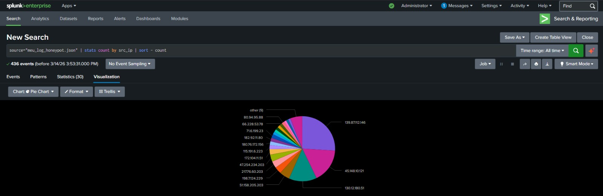
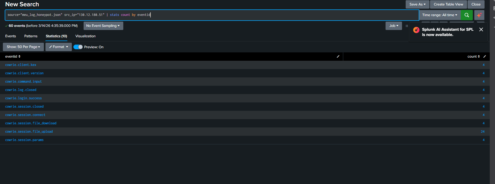
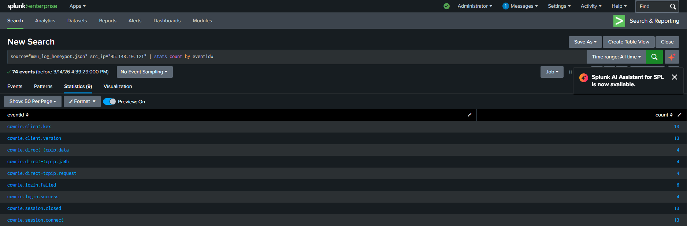
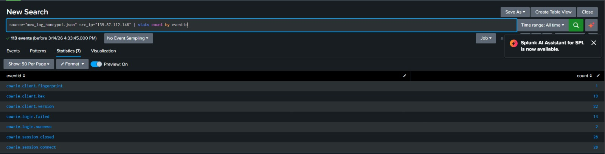
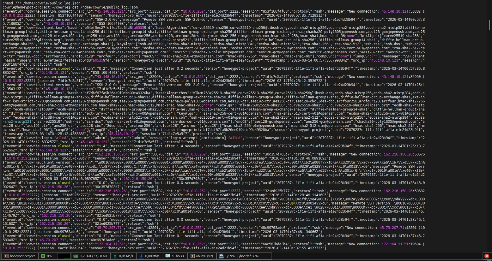

# Cloud Honeypot & Threat Intelligence Lab
Implementação de um Honeypot SSH (Cowrie) hospedado em infraestrutura Oracle Cloud, integrado ao Splunk Enterprise para ingestão, monitoramento e análise forense de ataques reais.

## Arquitetura do Projeto
### Visão geral da arquitetura

```
Internet
   │
Attackers / Bots
   │
Oracle Cloud Instance (Ubuntu 22.04)
   │
SSH Honeypot (Cowrie)
   │
JSON Logs (cowrie.json)
   │
Splunk Universal Forwarder
   │
Splunk Enterprise SIEM
   │
Dashboards & Threat Analysis
```


* **Cloud Provider:** Oracle Cloud Infrastructure (OCI) - Instância Ubuntu 22.04 LTS.
* **Honeypot:** Cowrie (SSH Interaction Honeypot).
* **SIEM: Splunk** Enterprise para centralização de logs e criação de dashboards.
* **Protocolo de Ingestão:** Monitoramento de arquivos JSON via Splunk Universal Forwarder.
---
## Análise de Ameaças e Dashboards

### Visualização Geral
Abaixo, a distribuição de ataques por endereço IP de origem capturados durante o período de monitoramento:



### Métricas Consolidadas (Curto período de exposição)
Principais dados extraídos via Splunk e enriquecidos com ferramentas de OSINT:

| Métrica | Resultado |
| :--- | :--- |
| **Total de Ataques Capturados** | +800 eventos |
| **Período de Coleta** | 13/03/2026 - 14/03/2026 |
| **Top 3 Países Ofensores** | China, Estados Unidos e Holanda |
| **Usernames mais visados** | root, admin, orangepi |
| **Senhas mais tentadas** | orangepi, password, admin |


## Guia de Implementação Técnica. 

### 1. Configuração do Ambiente (Linux)
Abaixo,os comandos utilizados para isolamento do ambiente e execução do serviço:


```bash
## Atualização de pacotes e instalação de dependências
sudo apt update && sudo apt install git python3-virtualenv libssl-dev -y

## Configuração do ambiente virtual Python
git clone http://github.com/cowrie/cowrie
cd cowrie
virtualenv --python=python3 cowrie-env
source cowrie-env/bin/activate

## Instalação em modo editável e execução do módulo
pip install --upgrade pip
pip install -e .
python -m cowrie
```
## 2. Monitoramento e Validação de Logs
Comando utilizado para validar a geração de logs estruturados antes da indexação no SIEM:
```tail -f var/log/cowrie/cowrie.json | jq```
Análise de Ameaças e Dashboards
###Visualização Geral
Abaixo, a distribuição de ataques por endereço IP de origem capturados durante o período de monitoramento:
Classificação de Perfis de Ataque
Realizei a triagem de 5 perfis distintos de atacantes com base na telemetria coletada:

|  Endereço IP     |   Perfil de Ataque  |                 Eventos Detectados                               |     Gravidade
| :--- | :--- | :--- | :--- |
| **130.12.180.51**    |   Invasor Ativo     |   Upload/Download de arquivos e execução de comandos.            |     Crítica
| **45.148.10.121**    |   Proxy/Tunneling   |   Tentativas de requisição direct-tcpip (SSH Tunneling).         |     Alta
| **139.87.112.146**   |   Brute Force       |   Ataque persistente com alto volume de tentativas.              |     Média
| **198.7.124.229**    |   Low-and-Slow      |   Acesso bem-sucedido após poucas tentativas de login.           |     Crítica
| **51.158.205.203**   |   Reconnaissance    |   Apenas reconhecimento de serviço e fingerprinting (Scanning).  |     Baixa

## Evidências Técnicas
#### 1.Tentativa de Transferência de Malware (IP 130.12.180.51)


#### 2.Detecção de SSH Tunneling (IP 45.148.10.121)


#### 3. Brute Force Persistente (IP 139.87.112.146)


#### 3.Monitoramento de Logs Brutos no Host



## Conclusão e Resultados
O projeto demonstrou a eficácia do uso de Honeypots para coleta de indicadores de comprometimento (IoCs). Através da integração com o Splunk, foi possível categorizar ameaças não apenas por volume, mas por intenção técnica, diferenciando scanners automáticos de invasores ativos.

